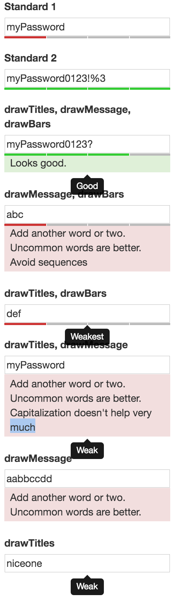

🔒🔍 strengthify
================

Combine jQuery and zxcvbn to create a password strength meter.



How to use
----------

As of 0.5.0, the wrapper will be automatically added beneath the target input field

Add `jquery` (tested with 1.10.0), `jquery.strengthify.js` and
`strengthify.css` to your document.

If using the message option, include bootstrap.

If using the titles option, include bootstrap's `tooltip.js`,

```HTML
<script src="jquery-1.10.0.min.js"></script>
<script src="tooltip.js"></script>
<script src="jquery.strengthify.js"></script>
<link rel="stylesheet" href="bootstrap.min.css" type="text/css">
<link rel="stylesheet" href="strengthify.css" type="text/css">
```

Because [zxcvbn](https://github.com/dropbox/zxcvbn) is really
heavyweight, it will be loaded asynchronously from `zxcvbn/zxcvbn.js`.
This can however be configured with an optional parameter.

Then call `.strengthify` on the password input field.

```JavaScript
$('#password-field').strengthify()
```

That's it. Now the password strength meter will be updated after
each keystroke.

Configuration
-------------

The path and the title of the different strength categories can
be configured with the first parameter of `.strengthify`.


<dl>
<dt>drawTitles</dt><dd> pop-up text (above)</dd>
<dt>drawMessage</dt><dd> detailed message beneath input</dd>
<dt>drawBars</dt><dd> password strength color progression bars beneath input</dd>
<dt>$addAfter</dt><dd> element after which the strengthify element should be inserted</dd>
</dl>

Default:

```JSON
{
  "zxcvbn": "zxcvbn/zxcvbn.js",
  "titles": [
    "Weakest",
    "Weak",
    "So-so",
    "Good",
    "Perfect"
  ],
  "drawTitles": false,
  "drawMessage": false,
  "drawBars": true,
  "$addAfter": null
}
```
Overwrite example:

```JavaScript
$('#password-field').strengthify({zxcvbn: 'my/path/to/zxcvbn.js'})
```

Versions
--------

<dl>
  <dt>0.5.3</dt>
  <dd>
    <ul>
      <li>make possible to specify the element to add the strength bar after (#20)</li>
      <li>provide minified version (#16)</li>
    </ul>
  </dd>
  <dt>0.5.2</dt>
  <dd>
    <ul>
      <li>use eval directly (#14)</li>
      <li>added missing break (#13)</li>
    </ul>
  </dd>
  <dt>0.5.1</dt>
  <dd>add tilesOptions (#10) - you can choose now between tooltip and element or both - thanks to @feirer</dd>
  <dt>0.5.0</dt>
  <dd> fairly substantial changes:
    <ul>
        <li>added feedback message</li>
        <li> $.each(...) functionality</li>
        <li> restructuring wrapping</li>
        <li> feature flags</li>
    </ul>
     "strengthify-wrapper" added automatically beneath target input
  </dd>
  <dt>0.4.1</dt>
  <dd>hotfix for missing ;</dd>
  <dt>0.4</dt>
  <dd>syntax and performance cleanups</dd>
  <dt>0.3</dt>
  <dd>some fixes:
    <ul>
      <li>migrate from "display" to "opacity"</li>
      <li>fix pasting to input field</li>
      <li>add tipsy with strength</li>
    </ul>
  </dd>
  <dt>0.2</dt>
  <dd>solve mimetype issues</dd>
  <dt>0.1</dt>
  <dd>Initial version</dd>
</dl>
